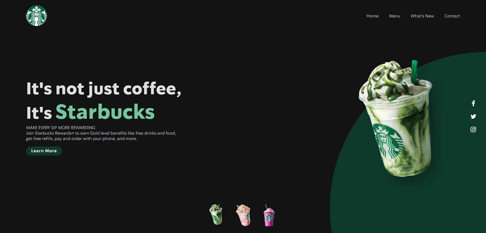

# Starbucks Landing Page Clone

A simplified clone of the Starbucks landing page built using HTML, CSS, and JavaScript.

## Description

This project is a basic representation of a Starbucks landing page. It includes a responsive navigation bar, a hero section with an image background, and a simple footer. The landing page also has a button that, when clicked, changes the hero section's background image using JavaScript.

## Demo

You can see a live demo of the Starbucks Landing Page Clone [here](https://n1khilnick.github.io/starbucks-landing-page-clone/).

## Features

- Responsive navigation menu
- Hero section with background image
- JavaScript functionality to dynamically change the hero background image when the user clicks on the image buttons representing the Frappuccino cups below.

## Technologies Used

- HTML
- CSS
- JavaScript

---

**Note:** This is a simplified clone and not an official Starbucks project.

Created by [N1khil](https://github.com/n1khilnick).
